# Motley Agent Skills & MCP Server

**Build data-driven reports and presentations with AI — without sacrificing accuracy or control.**

This package provides Claude with the skills and tools to create professional reports using [Motley](https://motley.ai), where generative AI meets deterministic, auditable data pipelines.

---

## What is Motley?

Motley enables **number-intensive reporting that combines the ease of use of Generative AI with the robustness and transparency of deterministic configs**.

Instead of hoping your AI gets the numbers right, Motley gives you:

- **A declarative DSL** for charts, tables, queries, and data-driven text — with powerful expressions and cross-references between elements
- **A flexible semantic layer** for business-relevant queries (use ours, import from your BI tool, or bring your own)
- **Tightly controlled LLM calls** for text generation that cite their sources and respect your data
- **Export anywhere** — Google Slides, PowerPoint, and HTML while preserving your original styling
- **Full MCP integration** so your AI assistant can create and manipulate everything programmatically

The result: reports that are both AI-assisted *and* trustworthy.

---

## What's in This Package?

### Skills

Domain knowledge that helps Claude understand Motley's data model and write correct code:

| Skill | What it does |
|-------|--------------|
| [`create-query`](docs/skills.md#create-query) | Build semantic layer queries with measures, dimensions, filters, and time intelligence |
| [`create-edit-chart`](docs/skills.md#create-edit-chart) | Create bar, line, pie, and funnel charts with customizable styling |
| [`create-edit-text-block`](docs/skills.md#create-edit-text-block) | Generate data-driven text with variable substitution and optional LLM enhancement |
| [`create-edit-table-block`](docs/skills.md#create-edit-table-block) | Build formatted tables with pivoting and flexible layouts |

### MCP Server

A complete set of tools for Claude to interact with Motley programmatically:

- [**Master tools**](docs/tools/master.md) — inspect structure, variables, copy/move/delete slides
- [**Layout tools**](docs/tools/layout.md) — browse templates, get thumbnails, create masters
- [**Element tools**](docs/tools/element.md) — create and edit charts, tables, text blocks, queries
- [**Datasource tools**](docs/tools/datasource.md) — explore data sources, add measures and dimensions
- [**Outline tools**](docs/tools/outline.md) — plan deck structure with outline sessions

---

## Quick Start

### Option 1: Skills Only (via skills.sh)

```bash
npx skills add MotleyAI/agent-skills -a claude-code
```

### Option 2: Claude Desktop Extension

Download the `.mcpb` file from [Releases](https://github.com/MotleyAI/agent-skills/releases) and drag it into Claude Desktop.

### Option 3: Claude Code with MCP

```bash
export MOTLEY_API_KEY="sk_your_key_here"
claude --plugin-dir /path/to/agent-skills
```

See [docs/setup.md](docs/setup.md) for detailed instructions.

---

## How It Works

```mermaid
flowchart LR
    subgraph AI["🤖 AI Assistant"]
        Claude["Claude"]
        Skills["Skills"]
        MCP["MCP Tools"]
    end

    subgraph Motley["⚙️ Motley Engine"]
        DSL["Declarative DSL"]
        Semantic["Semantic Layer"]
    end

    subgraph Export["📄 Output"]
        Slides["Google Slides"]
        PPT["PowerPoint"]
        HTML["HTML"]
    end

    subgraph Data["💾 Your Data"]
        DB[(Database)]
        BI["BI Tools"]
    end

    Claude --> Skills
    Claude --> MCP
    Skills --> DSL
    MCP --> DSL
    DSL --> Semantic
    Semantic --> DB
    Semantic --> BI
    DSL --> Slides
    DSL --> PPT
    DSL --> HTML

    style AI fill:#e8f4f8,stroke:#0891b2
    style Motley fill:#fef3c7,stroke:#d97706
    style Export fill:#dcfce7,stroke:#16a34a
    style Data fill:#f3e8ff,stroke:#9333ea
```



### The Flow


**Every number is traceable. Every chart is reproducible. Every report is auditable.**

---

## Documentation

- [Setup Guide](docs/setup.md) — Installation and configuration
- [Skills Reference](docs/skills.md) — Domain knowledge for queries, charts, text, and tables
- [MCP Tools Reference](docs/tools.md) — All 32 MCP tools with detailed argument documentation

---

## Learn More

- **Website:** [motley.ai](https://motley.ai)
- **Questions?** Open an issue or [book a demo](https://motley.ai/book-a-demo)

---

## License

MIT
